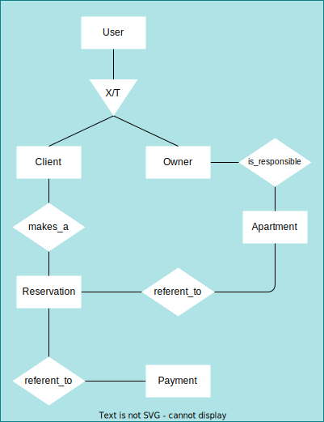

# Domínio

## Requisitos funcionais

1. Um usuário pode ser um cliente a fim de alugar um quarto.
   1. O usuário terá uma lista de quartos para alugar.
      1. Essa lista pode ser filtrada por localização, preço, tipo de quarto, etc.
   2. Todo quarto terá um proprietário.
   3. Para fazer a reserva de um quarto, o usuário deverá informar a data de entrada e saída.
   4. O pagamento será feito no momento da reserva.
   5. A forma de pagamento em boleto só poderá ser valida para reservas com mais de 7 dias de antecedência.
2. Um usuário também pode ser um proprietário a fim de disponibilizar um quarto para aluguel.
   1. Para disponibilizar um quarto, o usuário deverá informar o tipo de quarto, localização, preço, etc.
   2. O proprietŕio deve disponibilizar documentos que comprovam a propriedade do quarto.

## Entidades



### Usuário

```typescript

type UserProps = {
  name: string;
  email: string;
  password: string;
  phone: string;
  cpf: string;
  birthDate: Date;
}

type ClientProps = {
}

type OwnerProps = {
}

```

### Quarto

```typescript

type Location = {
  street: string;
  number: number;
  complement: string;
  city: string;
  state: string;
  country: string;
  cep: string;
}

type RoomStatus = 'AVAILABLE' | 'UNAVAILABLE';

type RoomProps = {
  location: Location;
  price: number;
  owner: Owner;
  status: RoomStatus;
}

```

### Reserva

```typescript

type ReservationProps = {
  room: Room;
  clientId: string;
  checkIn: Date;
  checkOut: Date;
  payment: Payment;
}

```

### Pagamento

```typescript

enum PaymentMethod {
  CREDIT_CARD = 'CREDIT_CARD',
  DEBIT_CARD = 'DEBIT_CARD',
  BOLETO = 'BOLETO',
  PIX = 'PIX',
}

type PaymentProps = {
  reservationId: string;
  amount: number;
  paymentMethod: PaymentMethod;
}

```
